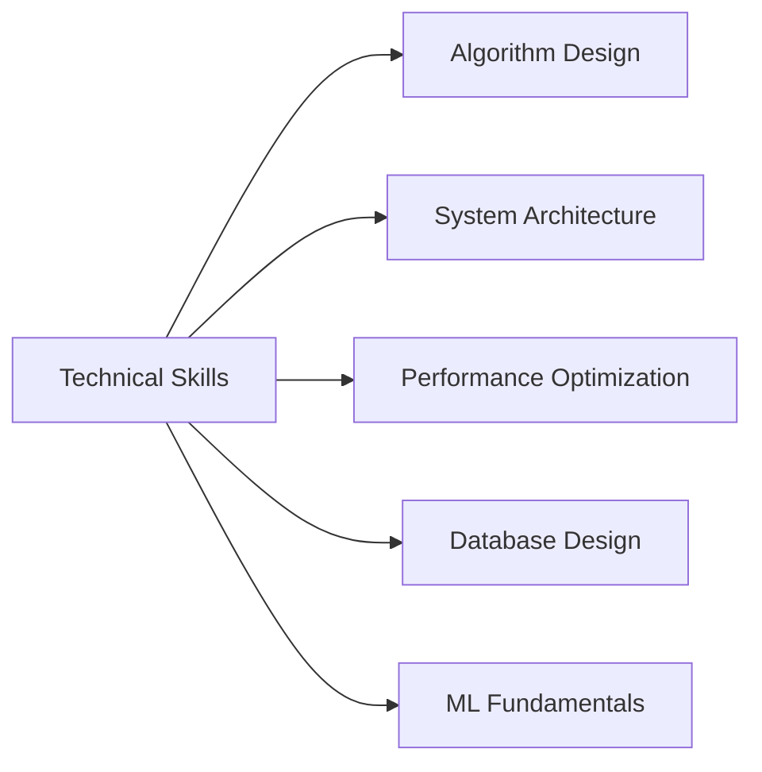

```markdown
---
<div align="center">

<!-- Анимированный заголовок -->


<!-- Бейджи контактов -->
<p align="center">
  <a href="https://t.me/man_who_eats_cake">
    
  </a>
  <a href="mailto:mikhail.b.smirnov@mail.ru">
    
  </a>
  <a href="https://resume-website-github-io.vercel.app/">
    
  </a>
  <a href="https://docs.google.com/document/d/1ao3taoIwhTjBZXFfj0OWTqVvAEjz3ZJSb5zUZsINh10/edit">
    
  </a>
</p>

<!-- Статистика -->
<p align="center">
  
  
</p>

</div>

---

## 👨‍💻 Обо Мне

```python
class SoftwareDeveloper:
    def __init__(self):
        self.name = "Михаил Смирнов"
        self.age = 20
        self.location = "Санкт-Петербург"
        self.education = "РГПУ им. Герцена, 3 курс"
        self.focus = ["Python Development", "C Programming", "AI/ML"]
        self.status = "🔍 Ищу стажировку/работу"
    
    def skills(self):
        return {
            "languages": ["Python", "C", "JavaScript", "SQL"],
            "frameworks": ["Qt", "Flask", "NumPy", "Numba"],
            "tools": ["Git", "Linux", "Docker", "Vercel"]
        }

dev = SoftwareDeveloper()
```

Студент-разработчик с passion к созданию эффективных и масштабируемых решений. Обладаю опытом в full-stack разработке, оптимизации алгоритмов и работе с большими данными.

---

## 🛠 Технологический Стек

### **🧬 Языки Программирования**
<p>
  
  
  
  
</p>

### **📚 Фреймворки & Библиотеки**
<p>
  
  
  
  
</p>

### **⚙️ Инструменты & Системы**
<p>
  
  
  
  
</p>

---

## 🚀 Проекты

### **🤖 Smart Receipt Scanner** | [](https://github.com/KOTorCAT/projects)
*Веб-приложение для автоматического распознавания и разделения расходов по чекам*
```python
# Технологии: Python, OpenCV, Tesseract, Flask, JavaScript
# Особенности: OCR, ML, Real-time processing, Multi-user support
```

### **🌌 Julia Fractal Generator** | [](https://github.com/KOTorCAT/projects)
*Высокопроизводительный генератор фракталов с GPU-ускорением*
```c
// Технологии: Python, C, NumPy, Qt5, CUDA
// Особенности: Parallel computing, Real-time rendering, Interactive UI
```

### **📊 Math Computation Suite** | [](https://github.com/KOTorCAT/projects)
*Комплексное решение для научных вычислений и визуализации*
```python
# Технологии: Python, Numba, Qt5, Matplotlib, SciPy
# Особенности: Numerical methods, Data visualization, Performance optimization
```

### **🛡️ MCHS Management System** | [](https://github.com/KOTorCAT/projects)
*Корпоративная система управления персоналом и оборудованием*
```javascript
// Технологии: JavaScript, HTML/CSS, SQL, REST API
// Особенности: Role-based access, Real-time updates, Advanced reporting
```

---

## 📊 GitHub Analytics

<div align="center">

<!-- Граф активности -->


<!-- Статистика -->
<table>
  <tr>
    <td align="center">
      
    </td>
    <td align="center">
      
    </td>
  </tr>
</table>

<!-- Streak stats -->
<p align="center">
  
</p>

</div>

---

## 🎓 Образование

### **РГПУ им. А.И. Герцена**
**Бакалавр компьютерных наук** | *2023–2027*  
- **Специализация:** Разработка ПО и обработка больших данных  
- **Средний балл:** 4.8/5.0  
- **Ключевые дисциплины:** Алгоритмы, ML, Базы данных, Distributed Systems  

### **Школа 21 (Сбер)**
**Интенсивная программа разработки** | *2024*  
- **Формат:** Peer-to-peer learning, Project-based  
- **Достижения:** Топ-10% по результатам обучения  
- **Фокус:** Алгоритмы, Системное программирование, Командная работа  

---

## 🌟 Навыки

### **Технические**


### **Профессиональные**
- **Командная работа:** Опыт работы в Agile/Scrum teams
- **Код-ревью:** Проведение и участие в code review процессах
- **Проектирование:** Архитектурное проектирование приложений
- **Оптимизация:** Профилирование и оптимизация кода

### **Языки**
- **Русский:** Родной
- **Английский:** Intermediate (B1) - Technical documentation, communication

---

## 📈 Текущие Цели

```python
current_goals = [
    "🎯 Углубить знания в Machine Learning",
    "🚀 Освоить Kubernetes и cloud-технологии",
    "📱 Разработать мобильное приложение",
    "🌐 Внести вклад в open-source проекты",
    "💼 Найти интересную стажировку/работу"
]

for goal in current_goals:
    print(f"• {goal}")
```

---

<div align="center">

## 📞 Контакты

<p align="center">
  <a href="https://t.me/man_who_eats_cake">
    
  </a>
  <a href="mailto:mikhail.b.smirnov@mail.ru">
    
  </a>
  <a href="https://github.com/KOTorCAT">
    
  </a>
  <a href="https://linkedin.com/in/your-profile">
    
  </a>
</p>

**Всегда открыт для новых вызовов и интересных проектов!** 🚀

⭐ *Если вам понравились мои проекты, не забудьте поставить звездочку на GitHub!*

</div>

